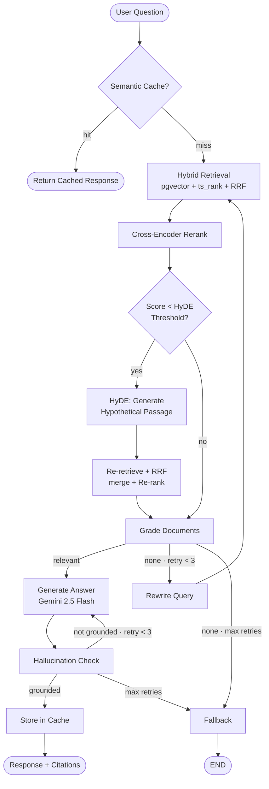
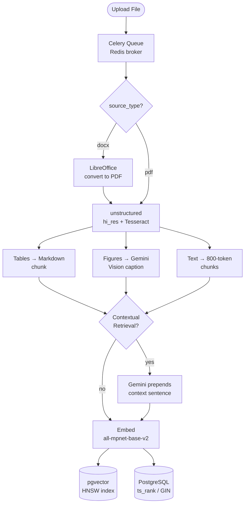

# DocuMind: Agentic Document Intelligence

> Chat with any PDF or DOCX file using a production-grade agentic pipeline powered by LangGraph, Gemini 2.5 Flash, hybrid search, real-time streaming, Clerk auth, and Postgres + pgvector storage.

[](https://github.com/robayedl/documind/actions/workflows/ci.yml)


---

## Demo

https://github.com/user-attachments/assets/aa924408-7f80-4968-b5b2-7e2bac769806

---

## Features

| Feature | Description |
|---|---|
| **Agentic RAG** | LangGraph pipeline with document grading, query rewriting, hallucination checking, and HyDE fallback on low-confidence retrieval |
| **Hybrid Search + Reranking** | Dense pgvector (HNSW cosine) + sparse `ts_rank` full-text, fused with RRF and cross-encoder reranking (`ms-marco-MiniLM-L-6-v2`) |
| **Contextual Retrieval** | Gemini prepends a context sentence to every chunk before embedding (Anthropic-style); dramatically improves retrieval precision for long documents |
| **HyDE Fallback** | On low reranker confidence, generates a hypothetical passage and re-retrieves for better recall |
| **MCP Server** | stdio + HTTP/SSE transports; `search_documents`, `list_documents`, `get_document` tools; API-key auth per user. Setup guide in the UI under **API Keys** |
| **Streaming + Recovery** | SSE token-by-token output; answer and cost persist to Postgres even on client disconnect; auto-recovered on next page load |
| **RAGAS Evaluation** | Faithfulness, answer relevancy, context precision & recall on a 30-question golden dataset |
| **Semantic Cache** | Redis vector cache; near-identical queries return instantly without hitting the LLM |
| **Multi-Source Ingestion** | PDF and DOCX. DOCX files are converted to PDF via LibreOffice on ingest and then processed through the same hi_res OCR pipeline |
| **Rich Document Parsing** | Tables extracted as Markdown; PDF figures captioned by Gemini multimodal |
| **PDF Viewer** | Inline PDF pane with citation-click-to-page-jump and snippet highlighting |
| **Background Ingestion** | Celery worker processes documents asynchronously. DOCX adds a Converting step before the shared Parsing -> Extracting -> Embedding -> Finalizing pipeline. UI polls with live progress |
| **Gemini 2.5 Flash** | Google's fastest frontier LLM for low-latency generation; also used for figure captioning and contextual retrieval |
| **Cost Tracking** | Per-query token + cost on every message; `/usage` dashboard with hourly, daily, weekly, monthly, all-time views |
| **Postgres + pgvector** | All metadata, embeddings, and conversation history in one Postgres instance (HNSW cosine + GIN full-text) |
| **Rate Limiting** | Redis token-bucket: 30 req/hr, 200 req/day per user; HTTP 429 + `Retry-After`; frontend toast with countdown |
| **PII Redaction** | Presidio: EMAIL, PHONE, SSN, CREDIT_CARD scrubbed from the user query before the agent sees it; restored in the final answer |
| **Auth & Isolation** | Clerk (Google + email); per-user document isolation; JWT/RS256 validation |

---

## Architecture

<table width="100%" border="1" style="border-collapse:collapse;border-color:#30363d;">
<tr>
<td width="50%" valign="top" align="center" style="padding:12px;border-color:#30363d;">

**Query Pipeline**



</td>
<td width="50%" valign="top" align="center" style="padding:12px;border-color:#30363d;">

**Ingestion Pipeline**



</td>
</tr>
</table>

---

## Tech Stack

| Layer | Technology |
|---|---|
| **API** | FastAPI, Uvicorn, Server-Sent Events |
| **Agent** | LangGraph, LangChain |
| **LLM** | Google Gemini 2.5 Flash |
| **Embeddings & Reranking** | HuggingFace `all-mpnet-base-v2`, `ms-marco-MiniLM-L-6-v2` |
| **Vector Store** | PostgreSQL + pgvector (HNSW cosine) + `ts_rank` full-text (hybrid) |
| **Database** | PostgreSQL (Supabase or self-hosted via Docker) |
| **Auth** | Clerk (Google + email, JWT/RS256) |
| **Cache** | Redis Stack (vector similarity + Celery broker/backend) |
| **Background Workers** | Celery: async ingestion queue with LibreOffice DOCX conversion |
| **Document Parsing** | unstructured hi_res, Tesseract OCR, Gemini 2.5 Flash multimodal |
| **Frontend** | Next.js 16 (App Router), shadcn/ui, Tailwind CSS |
| **MCP** | Model Context Protocol server (stdio + HTTP/SSE), API-key auth |
| **Evaluation** | RAGAS |
| **CI/CD** | GitHub Actions, Docker |

---

## Quick Start

### Prerequisites

- Docker & Docker Compose
- A [Clerk](https://clerk.com) account (free tier works)
- A Google AI Studio API key
- A Postgres instance; the `docker-compose.yml` spins one up automatically with pgvector

### Docker

```bash
git clone https://github.com/robayedl/documind.git
cd documind
cp .env.example .env
```

Edit `.env` and fill in `GOOGLE_API_KEY`, `CLERK_JWT_KEY`, and `DATABASE_URL`.

```bash
cp web/.env.local.example web/.env.local
```

Edit `web/.env.local` and fill in `NEXT_PUBLIC_CLERK_PUBLISHABLE_KEY`, `CLERK_SECRET_KEY`, and `NEXT_PUBLIC_API_URL`.

```bash
docker compose up --build
```

> The first build downloads ML models (~2 GB) and may take several minutes. Tables and indexes are created automatically on first startup.

| Service | URL / Notes |
|---|---|
| UI | http://localhost:3000 |
| API | http://localhost:8000 |
| API Docs | http://localhost:8000/docs |
| Worker | Background Celery process (no HTTP port, connects to Redis + Postgres) |

---

## Auth Setup (Clerk)

1. Create an app at [clerk.com](https://clerk.com) and enable **Google** and **Email** sign-in.
2. Go to **API Keys**: copy **Publishable Key** → `NEXT_PUBLIC_CLERK_PUBLISHABLE_KEY` in both `.env` and `web/.env.local`
3. Copy **Secret Key** → `CLERK_SECRET_KEY` in both `.env` (used by Docker web container) and `web/.env.local` (used in local dev)
4. Go to **JWT Templates → Default** → copy the **PEM public key** → `CLERK_JWT_KEY` in `.env` (wrap in double quotes)
5. Development keys (`pk_test_*`) automatically whitelist `localhost`; no domain configuration needed.

> In local dev without `CLERK_JWT_KEY`, the backend auto-creates a `dev_user` identity so you can test without signing in.

---

## API

All endpoints (except `GET /health`) require `Authorization: Bearer <clerk-jwt>`.

| Method | Endpoint | Description |
|---|---|---|
| `GET` | `/health` | Health check (no auth) |
| `GET` | `/documents` | List documents with status, progress, and page count |
| `POST` | `/documents` | Upload a PDF or DOCX; ingestion runs in the background, returns `{doc_id}` immediately |
| `GET` | `/documents/{doc_id}/status` | Poll ingestion progress: `{status, progress_percent, step}` |
| `POST` | `/documents/{doc_id}/stop` · `/reindex` | Cancel or re-enqueue an ingestion job |
| `DELETE` | `/documents/{doc_id}` | Delete document, chunks, and file |
| `POST` | `/query/stream` | Ask a question; SSE token stream + citations, persisted on disconnect |
| `GET` | `/conversations/{session_id}` | Fetch persisted messages for session recovery |
| `GET` | `/usage/me` | Cost and token summary; `?period=1h\|24h\|7d\|30d\|all` |
| `POST` · `GET` · `DELETE` | `/api-keys` · `/api-keys/{id}` | Create, list, and revoke MCP API keys |
| `GET` | `/mcp/sse` | MCP HTTP/SSE endpoint (auth via `X-API-Key`) |

---

## Environment Variables

**Backend / Docker** (`.env`):

| Variable | Default | Description |
|---|---|---|
| `GOOGLE_API_KEY` | — | **Required.** Google AI Studio key |
| `NEXT_PUBLIC_CLERK_PUBLISHABLE_KEY` | — | **Required.** Clerk publishable key |
| `CLERK_SECRET_KEY` | — | **Required.** Clerk secret key |
| `CLERK_JWT_KEY` | — | **Required in prod.** RSA PEM public key for JWT validation |
| `DATABASE_URL` | `postgresql://documind:documind@` `localhost:5432/documind` | Postgres DSN |
| `REDIS_URL` | `redis://localhost:6379` | Redis URL |
| `STORAGE_DIR` | `./storage` | Directory for uploaded files |
| `CORS_ORIGINS` | `http://localhost:3000` | Allowed origins (comma-separated) |
| `EXTRACT_FIGURES` | `true` | Caption PDF figures with Gemini Vision |
| `CONTEXTUAL_RETRIEVAL` | `true` | Prepend context sentence to each chunk before embedding |
| `SEMANTIC_CACHE_THRESHOLD` | `0.92` | Cosine similarity threshold for cache hit |
| `HYDE_THRESHOLD` | `0.3` | Reranker score below which HyDE triggers |
| `RATE_LIMIT_PER_HOUR` | `30` | Max queries per user per hour |
| `RATE_LIMIT_PER_DAY` | `200` | Max queries per user per day |
| `PII_REDACTION` | `true` | Strip PII from queries via Presidio |

**Frontend** (`web/.env.local`):

| Variable | Default | Description |
|---|---|---|
| `NEXT_PUBLIC_CLERK_PUBLISHABLE_KEY` | — | **Required.** Clerk publishable key |
| `CLERK_SECRET_KEY` | — | **Required.** Clerk secret key |
| `NEXT_PUBLIC_API_URL` | `http://localhost:8000` | Backend URL |

---

## Project Structure

```
documind/
├── app/
│   ├── auth.py           # Clerk JWT validation (FastAPI dependency)
│   ├── db.py             # SQLAlchemy async engine + session factory
│   ├── models.py         # ORM models: User, Document, Conversation, Message, ApiKey
│   ├── pricing.py        # Model cost table + compute_cost()
│   ├── ratelimit.py      # Redis token-bucket rate limiter
│   ├── redact.py         # Presidio PII redaction / restore
│   ├── storage.py        # File-system helpers (PDF read/write)
│   └── main.py           # FastAPI routes + MCP HTTP/SSE mount
├── mcp_server/
│   ├── auth.py           # API key hashing + DB validation
│   ├── server.py         # FastMCP tools: search_documents, list_documents, get_document
│   └── __main__.py       # stdio entry point: python -m mcp_server
├── worker/
│   ├── celery_app.py     # Celery app config (broker = Redis)
│   └── tasks.py          # ingest_document task: pending → processing → indexed / failed / stopped
├── rag/
│   ├── agents/           # LangGraph nodes: grader, generator, rewriter, hallucination check
│   ├── chains/           # Retrieval (pgvector + ts_rank + HyDE), reranking, generation
│   ├── store.py          # pgvector CRUD (add, search, clear)
│   ├── cache.py          # Redis semantic cache
│   └── ingest.py         # Unified PDF pipeline: hi_res + Tesseract OCR; LibreOffice DOCX conversion
├── migrations/           # SQL migrations: 001_init → 005_api_keys
├── legacy/
│   ├── scripts/          # One-off tooling (Chroma → pgvector migration)
│   └── streamlit/        # Previous Streamlit UI (kept for reference)
├── web/                  # Next.js 16 frontend (App Router, shadcn/ui, Clerk)
│   ├── app/              # Pages: /, /chat, /docs, /usage, /api-keys, /about, /how-to-use
│   ├── components/       # Nav, PdfPane, DocWatcher (global bg poller), shadcn primitives
│   ├── lib/              # Typed API client with auth headers (api.ts)
│   └── proxy.ts          # Clerk route protection for /chat, /docs, and /usage
├── eval/                 # RAGAS runner and golden dataset
└── tests/                # Python backend tests
```

---

## Evaluation

Results on a 30-question golden dataset built from **"Attention Is All You Need"** (Vaswani et al., 2017), scored by Gemini 2.5 Flash via [RAGAS](https://docs.ragas.io).

<!-- EVAL-RESULTS-START -->
| Metric | Score | |
|---|---|---|
| `faithfulness` | 0.984 | ███████████████████ |
| `answer_relevancy` | 0.887 | █████████████████ |
| `context_precision` | 0.882 | █████████████████ |
| `context_recall` | 0.933 | ██████████████████ |

_Evaluated on 30 questions · 2026-05-23 · full results in [`eval/results/latest.json`](eval/results/latest.json)_
<!-- EVAL-RESULTS-END -->

```bash
DOC_ID=<your_doc_id> make eval   # full run (~10 min)
make update-readme                # refresh scores without re-running
```

---

## Tests

```bash
make test        # backend
make test-ui     # frontend
make lint
```

---

## License

MIT: free to use, modify, and distribute.
